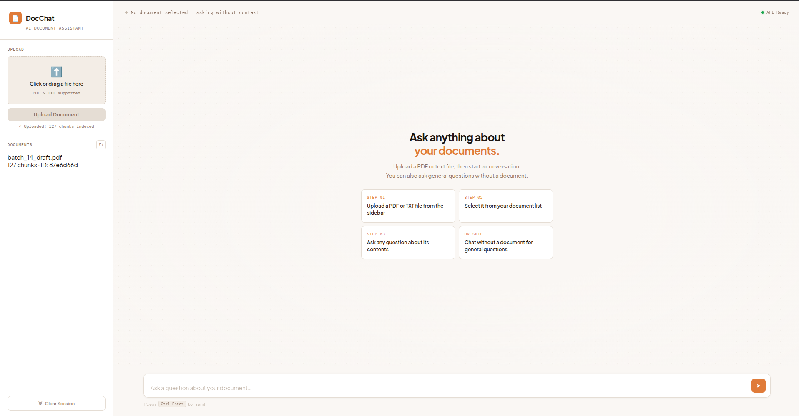
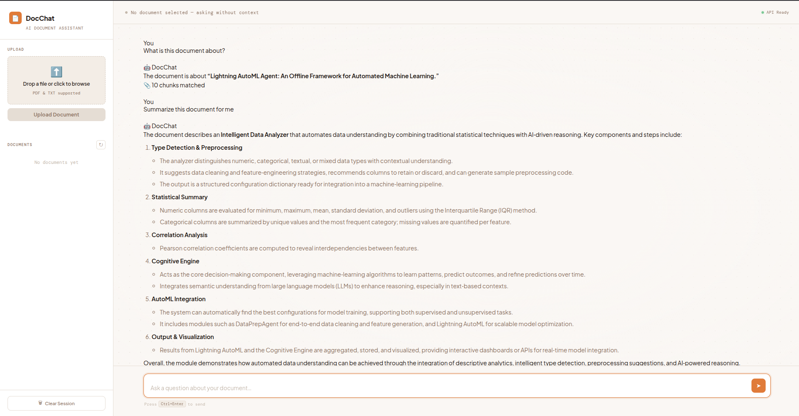
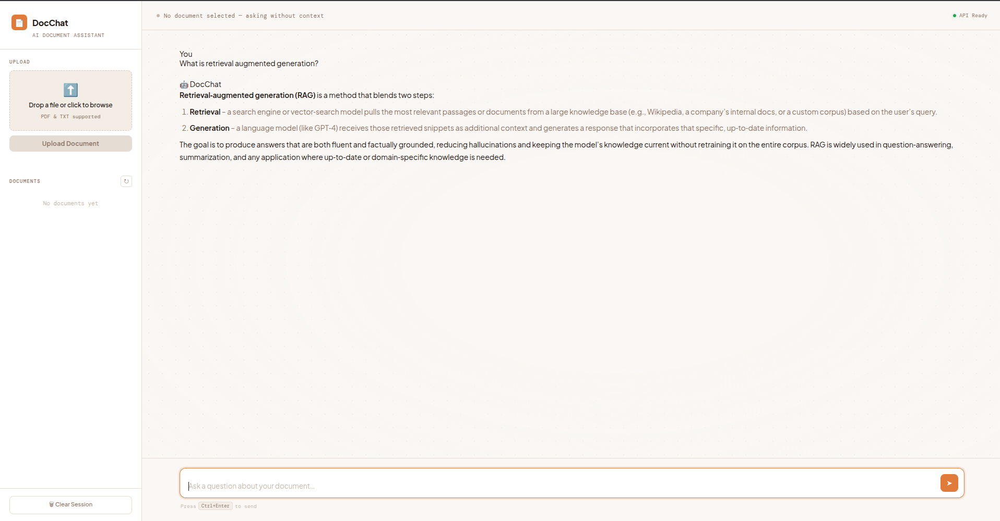

# DocChat AI 📄

A **Retrieval-Augmented Generation (RAG)** powered document Q&A application.
Upload **PDF or TXT documents** and ask questions about them using **semantic search + LLM reasoning**.

The system retrieves relevant document chunks using **FAISS vector search**, generates grounded answers using the **Groq LLM API**, and maintains **conversation memory** across turns within a session.

---

## 🔗 Live Demo

👉 https://huggingface.co/spaces/GoldSharon/docchat-ai

> ⚠️ Hosted on Hugging Face Spaces (free CPU tier).
> The app may take **20–60 seconds to start** if the Space is sleeping.

---

## 📸 Screenshots

### 1. Document Upload — Ready to Chat


### 2. RAG Response — Document Q&A


### 3. General Chat — No Document


---

## 🛠 Tech Stack

| Layer           | Technology                   |
| --------------- | ---------------------------- |
| Backend         | FastAPI (Python)             |
| LLM             | Groq API                     |
| Vector Database | FAISS                        |
| Embeddings      | sentence-transformers        |
| Memory          | In-process session store     |
| Frontend        | HTML + CSS + Vanilla JS      |
| Deployment      | Hugging Face Spaces (Docker) |

---

## ✨ Features

- Upload **PDF or TXT documents**
- **Semantic search** using FAISS vector embeddings
- **Context-aware answers** via RAG pipeline
- **Conversation memory** — the LLM remembers prior Q&A turns within a session
- **Semantic summary intent detection** — automatically fetches more chunks when you ask for an overview
- **Strict grounded responses** — answers are constrained to document content, no hallucination
- **General chat mode** when no document is selected
- **Markdown formatted responses**
- **Automatic session reset** on restart

---

## 🧠 How the RAG Pipeline Works

```
User uploads document
        ↓
Text extracted and split into chunks
        ↓
Chunks converted to embeddings (sentence-transformers)
        ↓
Stored in FAISS vector index
        ↓
User asks a question
        ↓
Semantic intent check (summary vs. factual)
        ↓
Question converted to embedding
        ↓
FAISS retrieves top-k relevant chunks
        ↓
Session memory (prior Q&A turns) retrieved
        ↓
Context + memory + question sent to Groq LLM
        ↓
LLM generates a grounded final answer
        ↓
Answer stored in session memory for future turns
```

---

## 💬 Conversation Memory

Each chat session is identified by a `session_id`. As you ask questions, the prior exchanges are stored in memory and injected into the LLM prompt on each subsequent turn. This enables follow-up questions like:

> "Who is mentioned in section 2?"
> *(next turn)* "What did you say about that person?"

Memory is **in-process and session-scoped** — it resets when the server restarts.

---

## 🔍 Summary Intent Detection

When your question semantically matches phrases like:

- *"summarize this document"*
- *"give me an overview"*
- *"what topics are covered"*

...the system automatically retrieves **10 chunks** with no relevance threshold, enabling a broad document summary rather than a narrow factual lookup.

---

## 🚀 Run Locally

### 1. Clone the repository

```bash
git clone https://github.com/YOUR_USERNAME/docchat.git
cd docchat
```

### 2. Create virtual environment

```bash
python -m venv venv
source venv/bin/activate
```

Windows:

```bash
venv\Scripts\activate
```

### 3. Install dependencies

```bash
pip install -r requirements.txt
```

### 4. Set environment variables

Create `.env`:

```env
GROQ_API_KEY=your_api_key_here
GROQ_MODEL=llama3-70b-8192
MIN_RELEVANCE_SCORE=1.0
CHUNK_SIZE=500
CHUNK_OVERLAP=50
```

Get a free key at 👉 https://console.groq.com

### 5. Run the application

```bash
uvicorn app.main:app --reload
```

### 6. Open the browser

```
http://localhost:8000
```

---

## 📁 Project Structure

```
docchat/
├── app/
│   ├── api/
│   │   ├── __init__.py
│   │   ├── models.py
│   │   ├── routes.py
│   │   └── upload_routes.py
│   ├── core/
│   │   ├── __init__.py
│   │   └── config.py
│   ├── services/
│   │   ├── __init__.py
│   │   ├── document_services.py
│   │   ├── faiss_services.py
│   │   ├── groq_service.py
│   │   ├── memory_service.py       ← NEW: session memory store
│   │   ├── ollama_service.py
│   │   └── rag_service.py          ← updated: memory + intent detection
│   ├── static/
│   │   ├── app.js
│   │   ├── index.html
│   │   └── style.css
│   └── main.py
├── Dockerfile
├── requirements.txt
└── README.md
```

---

## 🔑 Environment Variables

| Variable            | Description                              |
| ------------------- | ---------------------------------------- |
| `GROQ_API_KEY`      | API key for Groq LLM                     |
| `GROQ_MODEL`        | Model used for generation                |
| `MIN_RELEVANCE_SCORE` | FAISS similarity distance threshold    |
| `CHUNK_SIZE`        | Document chunk size (characters)         |
| `CHUNK_OVERLAP`     | Overlap between chunks (characters)      |

---

## 📡 API Overview

| Method | Endpoint         | Description                        |
| ------ | ---------------- | ---------------------------------- |
| POST   | `/chat`          | Ask a question (RAG or general)    |
| POST   | `/upload`        | Upload a PDF or TXT document       |
| GET    | `/health`        | Health check                       |
| GET    | `/stats`         | FAISS index statistics             |

**Chat request body:**

```json
{
  "question": "What is the main topic of this document?",
  "document_id": "abc123",
  "session_id": "user-session-xyz"
}
```

---

## ☁️ Deployment

This project is deployed on **Hugging Face Spaces using Docker**.

Steps:

1. Create a Space and select **Docker SDK**
2. Add `Dockerfile` to the repo root
3. Push project via Git
4. Add secrets in Space settings:

```
GROQ_API_KEY
GROQ_MODEL
```

The Space automatically builds and deploys the application.

---

## 🤝 Contributing

1. Fork the repository
2. Create a feature branch
3. Commit your changes
4. Push to your fork
5. Open a Pull Request

---

## 📜 License

MIT License — free to use and modify.